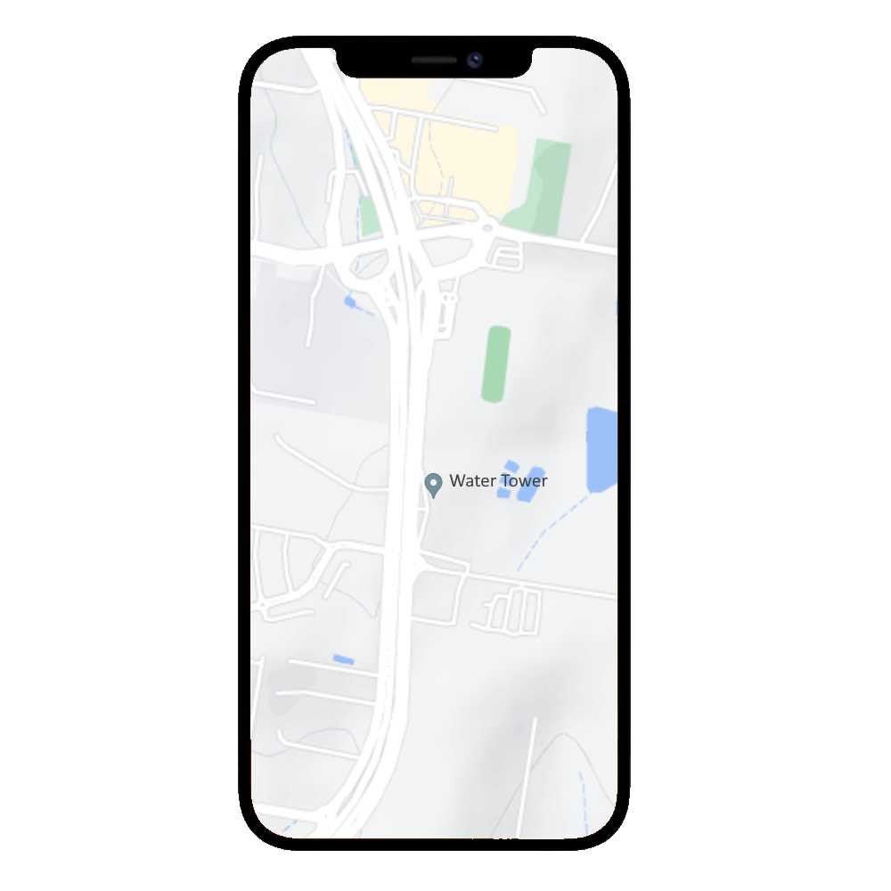
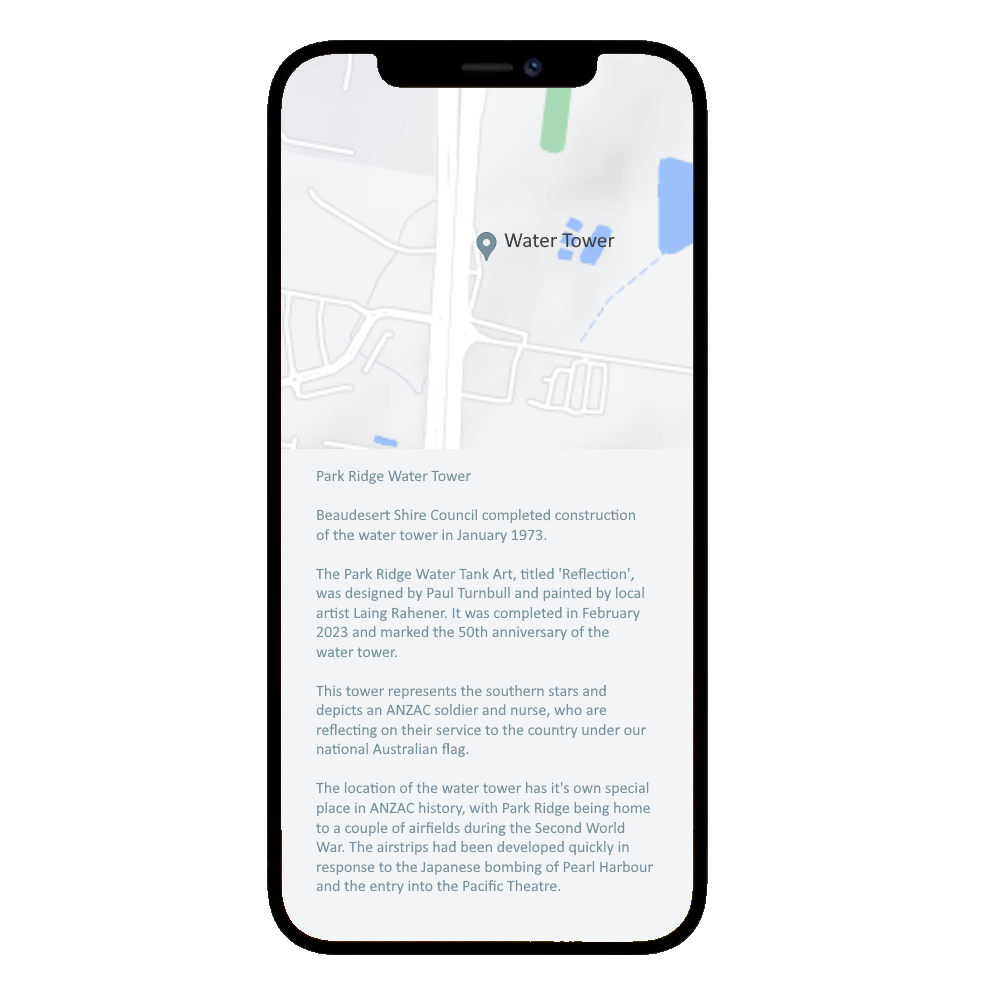
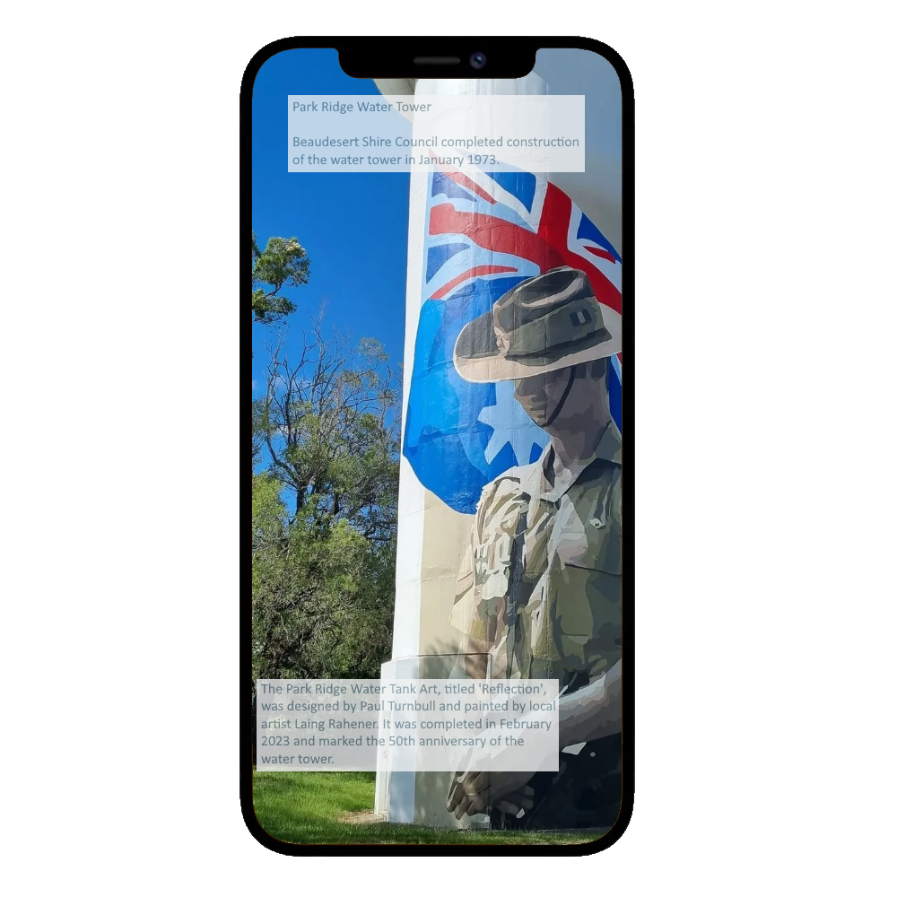
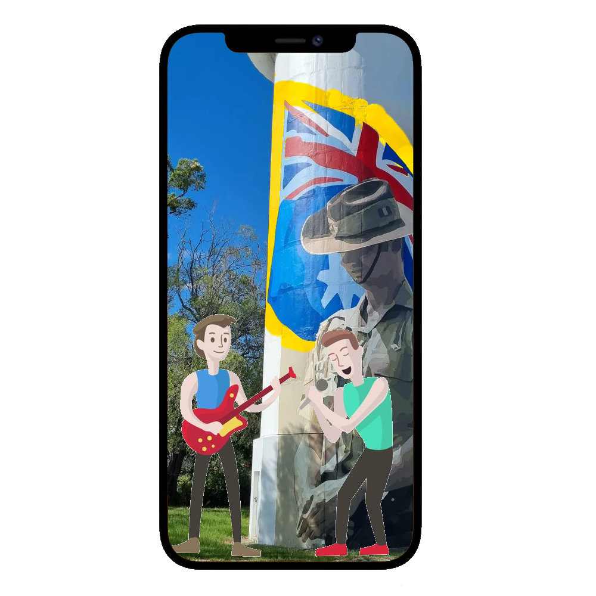
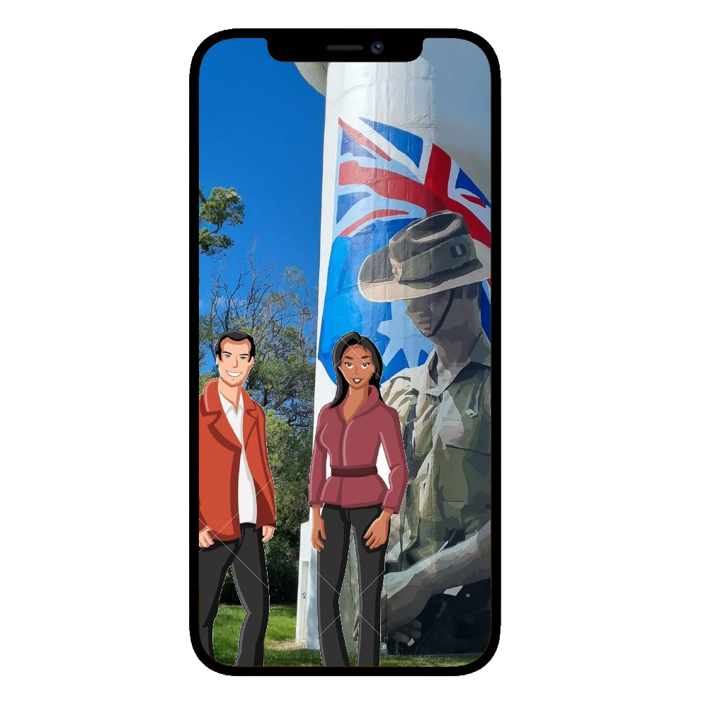

# The Solution

Story Points is a proposed gamified street map that will show cultural and heritage locations, as well as parks and recreational facilities.

## Phase 1 - The Story Points Mobile App

There aren't any APIs available to provide the geospatial coordinates required or the historical narratives required for the info panels. Also, the required information is disparate and poorly structured. A central server that the app can query, where all the data is curated and ready to go will be required.

The information in this panel took several hours of research because Google and Bing get the Park Ridge Water Tower confused with the Logan West Water Tower. One even tried to tell me that the Park Ridge Water Tower was built in 2022 - having confused the date that the artwork began with the date that te tower construction began (1973).

Local knowledge about the various artworks would be ideal.

This page neglects the designs required for the gamification aspects of "checking in" at a location, sending digital postcards to contacts, logging photos being taken, or identifying that a contact is with you.

## Phase 2 - Augmented Reality

At it simplest this is just a more complicated version of the maps information panel, but the enrichment comes from actually seeing someone throw a boomerang, or sing, or to have a digital guide point you to the next significant location.

Or even to have digital only events.

This is more than a simple API, because now we're retrieving large volumes of media (music, video, 3d models, etc).

## Phase 3 - Virtual Reality

Virtual Realty requires separate applications be developed for PC/playstation/xbox/etc. To have players interact requires the server know where they are, a voice chat server, and to have parental controls to ensure that your kids are looking at Parliament House and not talking to strangers.

But I'd sure like to visit the Kimberly region in Western Australia with my interstate family, while enjoying my air-conditioned living room.
